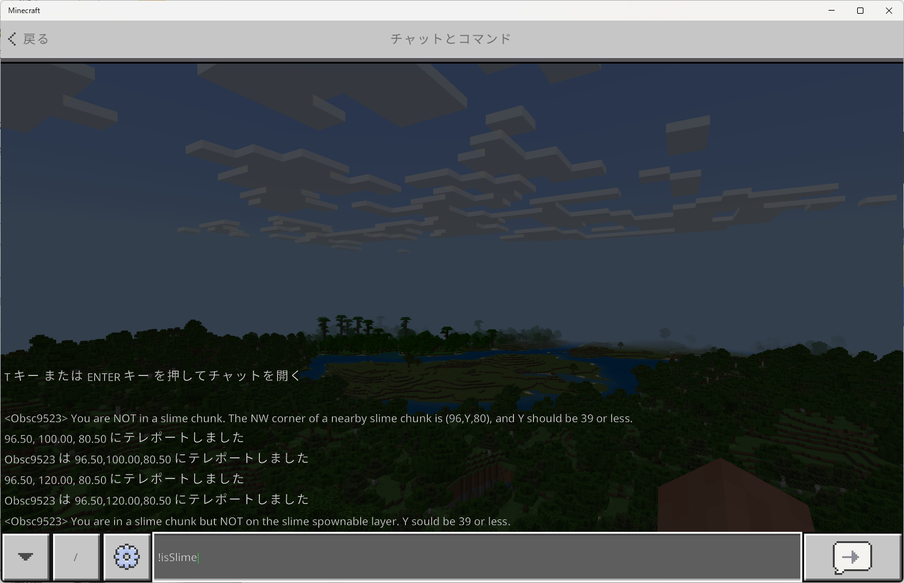

# SlimeFinderAddonBE
 

Tools for findeing slime chunks in Minecraft Bedrock.
 マインクラフト統合版でスライムチャンクを探すためのアドオンです。

Latest release (ver. 0.1.0) is [here](https://github.com/obscraft23/SlimeFinderAddonBE/releases/tag/v0.1.0).
 最新版(ver. 0.1.0)のダウンロードは[こちら](https://github.com/obscraft23/SlimeFinderAddonBE/releases/tag/v0.1.0)

## Features 特徴
* No coordinate limitation since the code check if the position is a slime chunk without using pre-inputed data (e.g., look-up table).
  Slime chunks generation is independent of the world seed (exclusive to Bedrock) and can be performed by using Mersenne Twister.

* 座標の範囲に制限はありません（事前に既知スライムチャンクのデータを与えるのではなく、その場で計算を行うからです）。
 統合版のスライムチャンクの場所はシード値とは無関係にMersenne Twisterによって生成された疑似乱数によって決定されます。

## How to use 使い方
You need to activate "beta API" and "holiday creator feature".
 インポートしたら、ワールドで使用する際には「ベータAPI」と「ホリデークリエイターの特徴」をONにしてください。

### Custom Command カスタムコマンド

* Just type "!isSlime" in chat. チャット欄で「!isSlime」と打つだけです。
* Check if you are in slime chunks. 現在地がスライムチャンクか教えてくれます。
* Tell you a nearby slime chunk if you are not in slime chunks.  現在地がスライムチャンクでなければ、近くのスライムチャンクの座標を教えてくれます。

### Slime Chunk Viewer
Under development 現在開発中です。

* Visualize slime chunks around the player via grid textures. (例)プレーヤー周囲のスライムチャンクをグリッド表示する。
* Allways check if you are in slime chunks and tell you via sidebar (例)現在地がスライムチャンクかどうかサイドバーに常に表示する。

## Reference
* Slime finder pe: https://github.com/depressed-pho/slime-finder-pe
 They originally found the generation rule of slime chunks by reverse engineering.
 スライムチャンクの生成ルールの発見者。

* Mersenne Twister in JavaScript: https://magicant.github.io/sjavascript/mt.html
 Random number sequence generator used in Minecraft Bedrock.
 マインクラフト統合版で使われている疑似乱数。

## Contact 連絡先

