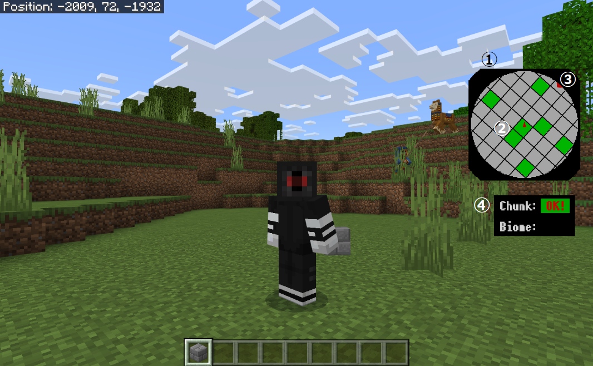

# Slime Chunk Finder Addon BE
 

日本語は[こちら](https://github.com/obscraft23/SlimeFinderAddonBE/blob/main/docs/README_jp.md)から

This resource pack is an in-game slime chunk finder for Minecraft Bedrock eddition.

Latest release (ver. 1.0.0) is available [here](https://github.com/obscraft23/SlimeFinderAddonBE/releases/tag/v1.0.0).

## Installation
* You have to activate **"Molang features"**.
* The pack is unstable in the first-person view at this moment. Please use it in the **third-person view**.
* Using other resource packs together probably prevents the pack from working properly. You need to put the pack on top of the active resource pack list.

## How to use
1. **Minimap**
 Current player's position is displayed on the minimap in the HUD screen.

2. **Slime chunks**
 Slime chunks are highlighted with green color.

3. **Direction**
 The minimap rotates according to the player's view direction. The red triangle marker represents the north direction.

4. **Information panel**
  If you are in swamp or mangrove swamp, two of the slime spawnable biomes, "OK!" is displayed in "biome".
  If you are in a slime chunk, "OK!" is displayed in "chunk".

## Features and Notice
* No coordinate limitation. The code accepts 24 bit numbers and will properly work within ~10M blocks from the world origin in principle.
* The code calculates slime chunks every ~2 seconds to reduce the workload. Therefore, The viewer might be unstable when you move over chunks and/or move very fast.
* The rendering is a bit unstable at the edge of the viewer.

## Custom Command (decomissioned)
* The custom command to search slime chunks is decomissioned after v1.0.0 release, but still available in the "BP" directory.
* You need to activate "beta API" and "holiday creator feature".
* Usage in game: just type "!isSlime" in chat.

## Licence
* The code is distributed under the [MIT Licence](https://github.com/obscraft23/SlimeFinderAddonBE/blob/main/LICENSE.txt).

## Reference
* Slime finder pe: https://github.com/depressed-pho/slime-finder-pe
 They originally found the generation rule of slime chunks by reverse engineering.

* Mersenne Twister in JavaScript: https://magicant.github.io/sjavascript/mt.html
 Random number sequence generator used in Minecraft Bedrock.

* PixelMplus: https://itouhiro.hatenablog.com/entry/20130602/font
 a font used in the pack.

## Contact

